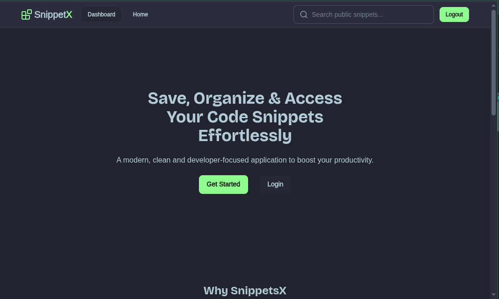
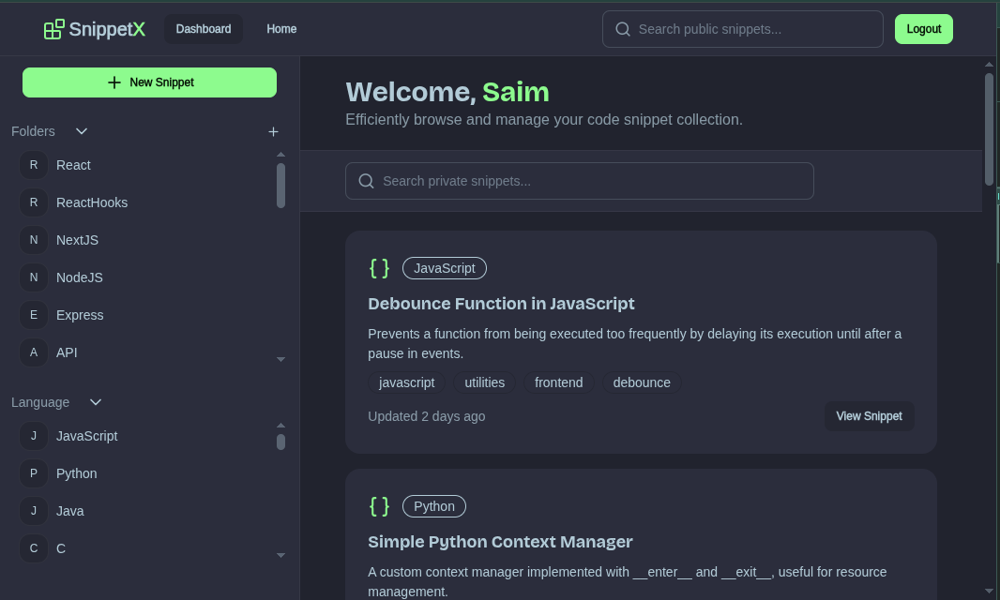
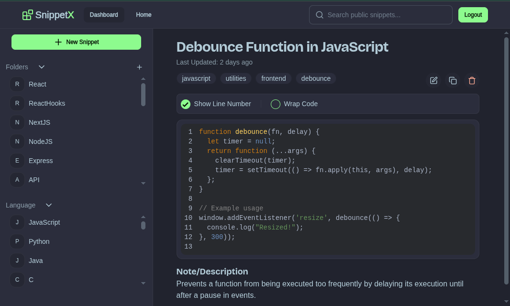
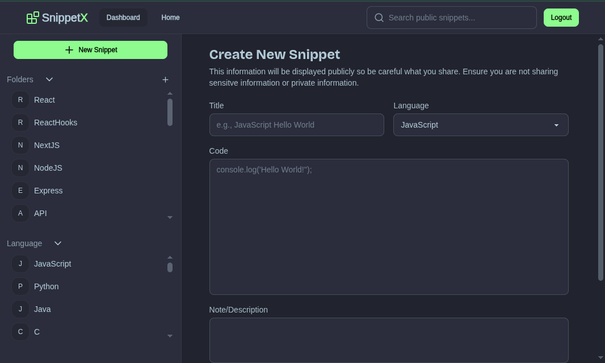
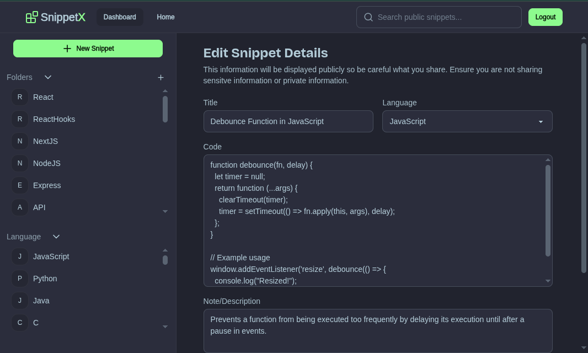

# **SnippetX — Code Snippet Saver & Organizer**

SnippetX is a web application that allows developers to save, organize, search, and manage code snippets.
Built for speed, simplicity, and productivity — perfect for developers who want a lightweight alternative to Notion/Gists.

---

## **Page Screenshots**

**Home/Landing Page**


**Dashboard Page**


**Single Snippet Page**


**New Snippet Page**


**Edit Snippet Page**


---

## **Features**

- Create, edit, delete code snippets
- Syntax highlighted editor
- Tags & categories for quick organization
- Pagination
- Search snippets instantly
- Dashboard with stats
- User authentication (Login/Signup/Logout)

---

## **Tech Stack**

- **Frontend:** React.js, TypeScript, TailwindCSS
- **Backend:** Node.js, NestJS
- **Database:** MongoDB
- **Package Manager:** pnpm
- **Auth:** JWT + Cookies

## **Architecture Overview**

```bash
[React Frontend]  → REST API →  [Express Backend]  → [MongoDB]
       ↓                     ↓                 ↓
   UI Pages        API Routes & Middleware   Models & Schema
```

**Core Flows:**

- Auth Flow → JWT tokens stored in HTTP-only cookies
- Snippet Flow → Create → Save → Fetch → Render in editor
- Search Flow → MongoDB text index + frontend filtering

---

## **Setup & Installation**

### **Frontend**

```sh
cd web
pnpm install
pnpm dev
```

### **Backend**

```sh
cd server
pnpm install
pnpm start:dev
```

### **Environment Variables**

Backend `.env` example:

```env
PORT=3000
MONGODB_URI=
JWT_SECRET=
HOSTS_URI="http://localhost:5173 http://localhost:5174"
```

Frontend `.env` example:

```env
VITE_API_BASE_URL="http://localhost:3000/api"
```

---

## **API Endpoints**

### Auth

```bash
POST /auth/register
POST /auth/login
POST /auth/logout
GET  /users/profile
```

### Snippets

```bash
POST   /snippets
GET    /snippets
GET    /snippets/stats
GET    /snippets/:id
PUT    /snippets/:id
DELETE /snippets/:id
```

---

## **How to Use**

1. Sign up using email and password
2. Create your first snippet
3. Tag it for easy filtering
4. View stats on dashboard
5. Search snippets using keywords
6. Edit or delete when needed

---

## 🤝 Contributing

Pull requests are welcome! If you’d like to contribute, feel free to fork the repo and submit a PR.

## 📄 License

This project is open-source and available under the MIT License.
